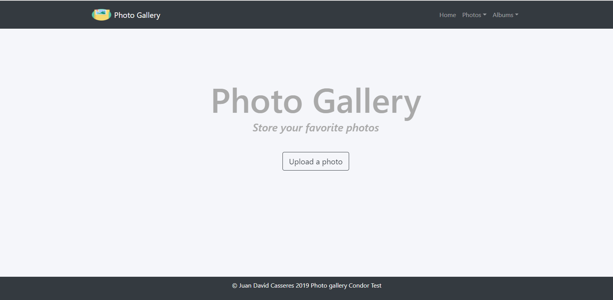

# CondorLabsTest-PhotoGallery
Applying Condor Labs test

## Deployment

### Api
- To start our services first clone the respository `git clone https://github.com/jdcr1425/CondorLabsTest-PhotoGallery.git`
- Then to get our services started open the folder `Photo Gallery Backend` and install the dependencies with `npm install`. Now just type 
`node index`.

### DataBase

-Go to `Photo Gallery Backend` and look for a folder named as `database` and execute that script sql to create the database.

### Web application
-Now, we have our servcice started and our database ready. Go to the other folder in the repository `Photo Gallery Frontend` and install the dependencies with `npm install` and the execute `npm start` and go to `http://localhost:3000` . if all is ok you will have a screen like this :

